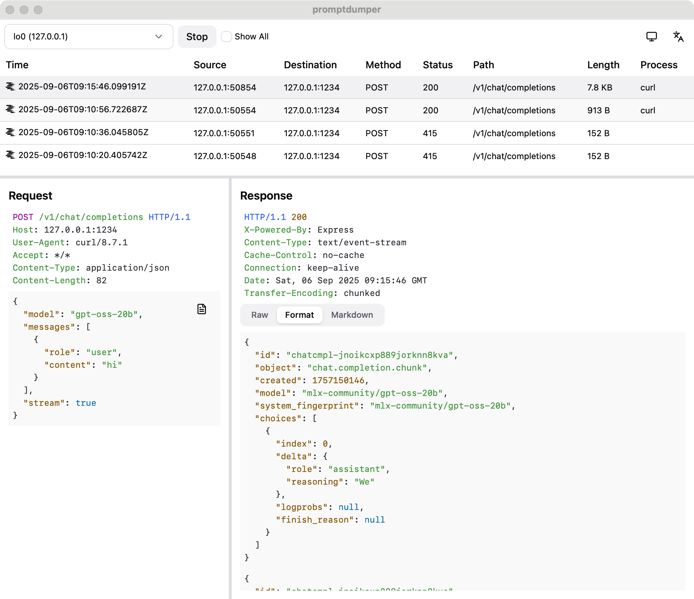
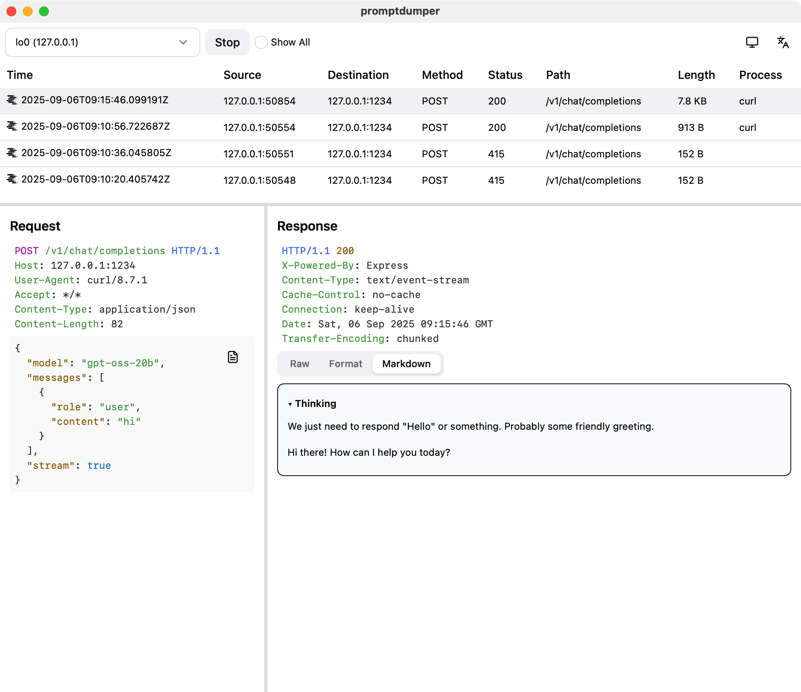
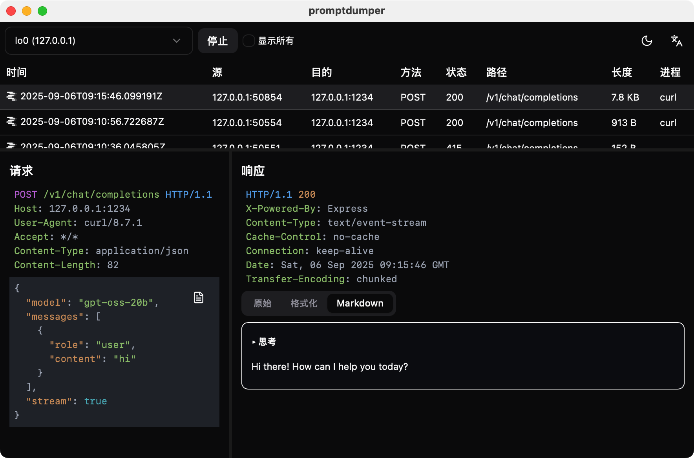

# promptdumper

LLM 提示词抓包工具，支持本地 Ollama 与 LM Studio 等模型对话的请求响应的解析和高亮显示。

一直想要做一个**最小体积**的桌面应用，于是有了这个项目。

## Features

- LLM 调用识别与标记（🧠），支持 OpenAI 兼容与 Ollama；支持自定义规则
- 支持SSE/ndjson（`Content-Type: text/event-stream`）增量展示；支持Stream数据的 JSON 格式化与高亮
- 支持`Transfer-Encoding: chunked`的完整响应的获取和显示
- Header 与 Body 高亮（JSON/HTML/JS/XML/Plain/Hexdump），Body 支持 Pretty/Raw以及内容Markdown的 切换
- 支持Reasoning和Content的提取和显示
- 支持请求的进程信息提取（macOS）
- 列表右键支持“复制为 curl/Copy as curl”，可复现请求（自动选择 http/https）
- 跨平台桌面应用
- 多语言、多主题

## 截图

### 主界面

### 响应的Markdown解析

### 中文暗色主题

